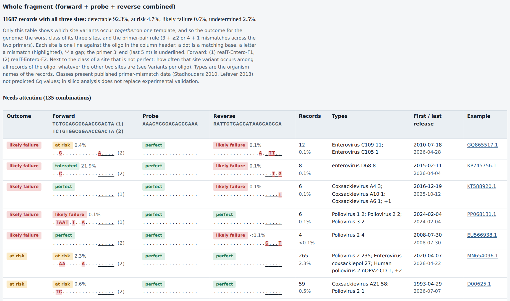

# qpcr-assay-check

Re-evaluate a real-time PCR (TaqMan) assay each year against all current public NCBI sequence
data: which genomes of your target still match your primers and probe, which escape, and whether
anything you must not detect is now predicted to amplify.

- **Every genome, not a sample.** Every genome assembly (bacteria, NCBI Datasets) or every
  Nucleotide record (viruses) of the target is checked, in resumable batches. Multi-copy targets
  are judged by the best-binding copy.
- **A graded mismatch class for every primer and probe site**: perfect, tolerated, at risk,
  likely failure or indeterminate, from published primer-mismatch studies (Stadhouders 2010,
  Lefever 2013), with the rule and source shown for each class.
- **"Needs attention"**: the forward, probe and reverse combinations that put detection at risk,
  with the organism types, release years and example accessions.
- **Specificity per search tier**: the taxa you must not detect, a clinical organism list and the
  human background, by remote taxon-restricted BLAST with full-length re-alignment and predicted
  off-target products.
- **A record for your quality system**: an HTML report, JSON record and Excel workbook with the
  tool version and a SHA-256 hash of the inputs, compared with the previous run of the same assay.
  NCBI is only used remotely; there is no local database to maintain.

> **In silico analysis does not replace experimental validation.** The laboratory must verify
> this software within its own quality system before relying on its output.

## Example: an enterovirus assay

The whole-fragment table shows which site variants occur *together* on one genome and what that
means for detection. Its first part, "Needs attention", lists the combinations that are not
detectable, most frequent first per outcome:

[](docs/images/needs_attention_enterovirus.png)

Each site is written against its oligo in the column header: a dot is a matching base, a letter a
mismatch in the genome, the primer 3′ end is underlined; (1) and (2) say which of the two forward
primers binds best. Next to a site's class: how often that site variant occurs among all records.
A genome's outcome is its worst site, or likely failure when the two primers together carry too
many mismatches (Lefever 2013). "Undetermined" (further down the table) is a single mismatch in
an MGB probe: no published data say whether it matters, so those genomes are counted neither as
detected nor as escapes.

What a laboratory would do with these rows: the 265 poliovirus type 2 records share one at-risk
F2 variant, so a template of that variant is worth testing, and worth checking whether it comes
from one study; the small likely-failure groups (4 to 12 records) are worth a look at their
sequence quality and origin first.

*Example from a run on 2026-09-25 against that day's NCBI data (qpcr-assay-check 1.3.0 with
later development changes). Numbers change as NCBI grows; they illustrate the output and are not
a performance claim for this assay. Classes present published primer-mismatch data, not predicted
Cq values. The oligos are an in-house enterovirus assay supplied by the user, not checked against
a publication ([docs/examples/enterovirus_realt.yaml](docs/examples/enterovirus_realt.yaml)).*

## Who it is for, and what it is not

For clinical microbiology laboratories that re-evaluate their own TaqMan assays once a year, and
for the reviewers of that evaluation. It is not a primer design tool, not a validation, and it
does not predict Ct values or analytical sensitivity: it shows where public sequences differ from
your oligos and how published data classify those differences.

## Install

Docker, no Python needed (the image holds only the tool; nothing is downloaded at build time
beyond its Python packages):

```bash
git clone https://github.com/zmeel/qpcr-assay-check.git
cd qpcr-assay-check
docker build -t qpcr-assay-check .
```

Or with Python 3.11 or newer:

```bash
pipx install git+https://github.com/zmeel/qpcr-assay-check.git
```

Docker details (users, bind mounts, running in the background): [docs/USER_GUIDE.md](docs/USER_GUIDE.md#install).

## Quick start

```bash
# a starter assay file with every option explained
qpcr-assay-check init my-assay

# edit my-assay/assay.yaml, then check it without running anything
qpcr-assay-check validate my-assay/assay.yaml

# a full run: shows the oligos and planned searches, asks, then sends them to NCBI
export NCBI_EMAIL="your.name@example.org"   # required by NCBI
export NCBI_API_KEY="..."                   # optional, allows more requests per second
qpcr-assay-check run my-assay/assay.yaml -o results
```

With Docker, prefix the commands with
`docker run --rm --user "$(id -u):$(id -g)" -e NCBI_EMAIL -v "$PWD/work:/work" qpcr-assay-check`
and add `-y` to `run` (there is no terminal to answer the question).

A first run takes from tens of minutes to several hours, depending on the size of the target and
the load on NCBI: the searches are queued remotely, and the variant analysis works through the
genomes in batches of a configurable size (run again to continue). Results are cached, so a rerun
the same week only redoes the analysis. `run --dry-run` shows what would be sent without sending
anything; `run --qc-only` uses no network at all.

**The oligo sequences are sent to NCBI's public servers.** This matters for proprietary assays.

## What the report contains

- **Verdict** (PASS, WARN, FAIL or INCOMPLETE) with every finding behind it. Missing evidence is
  never a pass, so the very first run of an assay ends INCOMPLETE: there is no previous run yet.
- **Variant summary**: coverage per oligo and the escapes (genomes without a detectable copy),
  the whole-fragment table (above), then the variants per oligo, each with how often it occurs.
- **Mismatch classes**: per site, with the rule and source; see
  [docs/MISMATCH_CLASSES.md](docs/MISMATCH_CLASSES.md).
- **Inclusivity per year**: the whole fragment and each oligo, against the number of records NCBI
  lists for that year.
- **Specificity**: per search tier whether any off-target product is predicted, which primer
  carries the discrimination and its closest site, and whether anything was left unassessed; the
  products and closest sites per species follow.
- **Changes since the previous run**: new variants, new off-target sites and products, changes
  in the percentages.
- **Oligo quality control** (Tm, GC, hairpins and dimers), folded near the end: it depends only
  on the oligo sequences.

Every row the report condenses is in the Excel workbook. For assays run as a panel (two targets
for one organism), `qpcr-assay-check panel` lists the genomes that escape every target.

## The assay file

The enterovirus assay of the example (shortened; the full file is
[docs/examples/enterovirus_realt.yaml](docs/examples/enterovirus_realt.yaml)):

```yaml
assay_name: Enterovirus (realT, in-house)
forward:                                   # two forward primers in the same mix
  - {name: realT-Entero-F1, sequence: TCTGCAGCGGAACCGACTA}
  - {name: realT-Entero-F2, sequence: TCTGTGGCGGAACCGACTA}
reverse: {name: realT-Entero-DHU-R, sequence: RATTGTCACCATAAGCAGCCA}   # R = A or G
probe:
  - {name: Entero-P, sequence: AAACMCGGACACCCAAA, reporter: FAM, modifications: [MGB]}
template_type: RNA
target:
  taxid: 12059                             # genus Enterovirus
  taxa:                                    # inside the genus, but not the intended target
    - {taxid: 3428501, role: must_not_detect, reason: "rhinovirus: Enterovirus alpharhino"}
    - {taxid: 3428503, role: must_not_detect, reason: "rhinovirus: Enterovirus betarhino"}
    - {taxid: 3428504, role: must_not_detect, reason: "rhinovirus: Enterovirus cerhino"}
    - {taxid: 3428509, role: out_of_scope, reason: "animal enterovirus: Enterovirus geswini (EV-G)"}
    # ... more rhinovirus and animal enterovirus taxa in the full file
reference_amplicons:
  - {name: EV-fragment, sequence: TCTGCAGCGGAACCGACTACTTTGGGTGTCCGTGTTTCCTTTTATTCTCATGTTGGCTGCTTATGGTGACAATT}
exclusivity_organisms: [Parechovirus]
settings:
  variants:
    source: blast_partitioned              # viruses: every Nucleotide record
    nucleotide_query: "6500:8500[SLEN]"    # near-complete genomes only
```

`must_not_detect` taxa are part of the specificity verdict; `out_of_scope` taxa are searched and
listed for information only. Several oligos per role (alternatives in the same mix), degenerate bases, reference amplicons,
taxa inside the target that the assay must not detect, and every setting: see
[the commented template](examples/assay_template.yaml) and the
[user guide](docs/USER_GUIDE.md#assay-file).

## Using it in a quality system

- Each run writes a folder with `report.html` (self-contained, no scripts, no external requests),
  `results.json`, `results.xlsx` and `hits.tsv`. Archive the folder; the report states the tool
  version, the settings and the SHA-256 hash of the inputs.
- Run the same assay into the same output folder each year: the report compares itself with the
  previous run.
- Record your own wet-lab results per oligo variant in the assay file (`evidence:`): genomes
  with that exact variant then take the laboratory's outcome instead of the in silico class
  ([user guide](docs/USER_GUIDE.md#laboratory-evidence-per-oligo-variant)).
- Exit codes follow the verdict (0 PASS, 10 WARN, 20 FAIL, 30 INCOMPLETE, 64 invalid input), so a
  run can be scripted.
- All thresholds are defaults drawn from common practice or the cited studies: review them for
  your laboratory ([docs/USER_GUIDE.md](docs/USER_GUIDE.md#configuration)).

## NCBI use

Remote only: BLAST (URL API), E-utilities and NCBI Datasets. The tool identifies itself with your
e-mail address (from `NCBI_EMAIL`, never from a file), keeps to NCBI's request limits, polls
politely and caches every result. See [docs/USER_GUIDE.md](docs/USER_GUIDE.md#ncbi-access).

## Limitations that change the interpretation

- Public databases are biased: some types, countries and outbreaks are sequenced far more than
  others, and a year's records are those published that year, not those collected.
- Sequencing errors and consensus ambiguity codes appear as variants; homopolymer runs are
  especially error-prone.
- The mismatch classes come from primer studies on DNA with one polymerase; no source covers
  probe mismatches or gaps, so those are shown as such (indeterminate or undetermined).
- BLAST is a heuristic: "no hit" is not proof of "no binding". Products from a single primer
  binding both strands are not predicted.
- Specificity covers only the tiers that were searched.
- None of this is a validation of the assay.

The complete list: [docs/USER_GUIDE.md](docs/USER_GUIDE.md#limitations).

## Documentation

| Document | Content |
|---|---|
| [docs/USER_GUIDE.md](docs/USER_GUIDE.md) | Install, commands, assay file, configuration, NCBI access, all limitations |
| [docs/MISMATCH_CLASSES.md](docs/MISMATCH_CLASSES.md) | The mismatch classes, their rules and sources |
| [docs/ARCHITECTURE.md](docs/ARCHITECTURE.md) | Design, and the NCBI behaviour it relies on (verified live) |
| [CHANGELOG.md](CHANGELOG.md) | Release history |
| [docs/FEATURE_IDEAS.md](docs/FEATURE_IDEAS.md) | Proposed features, not started |

## Development

```bash
pip install -e ".[dev]"
ruff check . && pytest -m "not live"   # live NCBI tests are never run in CI
```

## License

Apache License 2.0, see [LICENSE](LICENSE). The software is provided without warranty.
